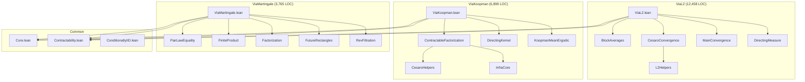

# Technical Lessons & Mathematical Insights

Detailed storylines for the AFM paper on formalizing de Finetti's theorem.

---

## Storyline 1: Three-Proof Comparative Study

### Quantitative Comparison

| Metric | ViaL2 | ViaKoopman | ViaMartingale |
|--------|-------|------------|---------------|
| **Total LOC** | 12,458 | 6,899 | 3,765 |
| **Submodule count** | 12 files | 18 files | 13 files |
| **Largest module** | CesaroConvergence (3,326) | ContractableFactorization (918) | PairLawEquality (603) |
| **Mathematical depth** | Elementary | Deep (ergodic) | Medium (martingale) |
| **Dependencies** | Lightest | Heavy | Medium |

### Dependency Analysis

**ViaL2** (Lightest):
- No ergodic theory imports
- No martingale machinery
- Pure L² space operations + Cesàro convergence
- Self-contained probability infrastructure

**ViaKoopman** (Heaviest):
- Imports `Ergodic/KoopmanMeanErgodic.lean`
- Shift-invariant σ-algebras (`InvariantSigma.lean`)
- Block injection and disjoint averaging
- Originally planned: full Koopman operator theory

**ViaMartingale** (Medium):
- Reverse filtration infrastructure
- Conditional independence (`CondIndep/` - 5 files)
- Future σ-algebras and rectangles
- Kernel theory (local infrastructure)

### Dependency Graph (Mermaid)



### Proof Friction Vignettes

**Vignette 1: ViaL2 Verbosity Paradox**

The "elementary" L² proof is the **largest** at 12,458 LOC. Why?

The issue: Cesàro convergence requires extensive infrastructure:
- `CesaroConvergence.lean` alone is 3,326 lines
- Telescoping bounds need careful L¹/L² norm management
- "Elementary" mathematically ≠ "simple" in formalization

Specific friction point: `alphaIicCE_right_continuous_at` required Dominated Convergence Theorem machinery that took multiple iterations to get the measurability hypotheses correct.

**Vignette 2: ViaMartingale Completion Paradox**

ViaMartingale was **completed first** despite initial assessment that kernel theory blockers would make it hardest.

What happened:
1. Initial blockers identified (kernel uniqueness, disintegration)
2. "Unblock-first, upstream-second" strategy applied
3. Local infrastructure created with TODO markers
4. Proof completed while infrastructure can be upstreamed later

Result: 3,765 LOC (smallest), completed December 26, 2025.

**Vignette 3: ViaKoopman Golfing Commits**

Multiple commits (`515cc0f7`, `e7679e0c`, `09fd6832`) show proof "golfing":
- Original proofs verbose and hard to maintain
- Systematic conversion to term mode
- `ext`, `rintro`, `simp` pattern simplifications

Indicates: The proof worked mathematically but struggled with Lean automation.

---

## Storyline 2: Koopman "Project Then Average" Reformulation

### The Original Plan (Textbook Approach)

Follow Kallenberg's "first proof" using full Koopman operator theory:

```
Textbook approach:
1. Define Koopman operator U : L²(μ) → L²(μ) by Uf = f ∘ T
2. Show U is an isometry (requires spectral theory)
3. Apply von Neumann Mean Ergodic Theorem
4. Birkhoff averages (1/n)Σ U^k f → Pf (projection to invariants)
5. Show Pf = E[f | shift-invariant σ-algebra]
6. Use factorization E[∏fᵢ | m] = ∏E[fᵢ | m] via Koopman theory
```

**Challenge**: Step 5-6 require heavy Koopman operator infrastructure (spectral decomposition, projection characterization).

### The Reformulation (Used)

ViaKoopman **still uses Mean Ergodic Theorem** for Cesàro convergence (via `birkhoffAverage` and `condexpL2` in `CesaroL2ToL1.lean`). The key simplification is in the **factorization step**.

**Key insight**: For shift-invariant σ-algebras, conditional expectation commutes with shift:

```lean
-- If m is shift-invariant (pseudocode):
E[f ∘ shift | m] =ᵐ[μ] E[f | m]
```

**Consequence for factorization**: Instead of proving `E[∏fᵢ | m] = ∏E[fᵢ | m]` via Koopman spectral theory, use **contractability directly**:
1. Block averaging gives strictly monotone indices
2. Contractability applies to strictly monotone selections
3. Telescoping L¹ bounds give convergence
4. Factorization follows from contractability, not Koopman theory

This **bypasses the Koopman-to-CE bridge** (Step 5-6 above), not MET itself.

### Implementation in Lean

Illustrative signatures from ViaKoopman infrastructure:

```lean
-- Step 1: Block injection gives strictly monotone indices (BlockInjection.lean:75)
lemma blockInjection_strictMono (m n : ℕ) (hn : 0 < n) (j : Fin m → Fin n) :
    StrictMono (blockInjection m n j)

-- Step 2: Contractability applies to any strictly monotone selection
-- (This is the definition of Contractable)

-- Step 3: Telescoping L¹ bounds via block averaging
lemma product_blockAvg_L1_convergence {m : ℕ} (fs : Fin m → α → ℝ) ... :
    Tendsto (fun n => ∫ ω, |∏ i, blockAvg n (fs i) ω - ∏ i, μ[fs i | mSI] ω| ∂μ)
            atTop (nhds 0)

-- Step 4: Conditional expectation factorizes products
lemma condexp_product_factorization_contractable {m : ℕ} (fs : Fin m → α → ℝ) ... :
    μ[∏ i, fs i | mSI] =ᵐ[μ] ∏ i, μ[fs i | mSI]
```

### Quantified Impact

| Aspect | Textbook Approach | Actual Implementation |
|--------|------------------|----------------------|
| **MET usage** | L² convergence | L² convergence (same) |
| **Factorization** | Koopman spectral theory | Contractability + telescoping |
| **Dependencies** | Koopman isometry, projection characterization | CE properties + contractability |
| **Core factorization LOC** | ~500 (estimated) | ~90 (self-contained) |
| **Status** | Would need spectral infrastructure | Complete |

### Formalization-Driven Discovery

This reformulation was discovered **because** of the type mismatch:
- Lean's type system made the full Koopman approach difficult (ambient L² vs. sub-σ-algebra)
- Forced exploration of alternatives for the factorization step
- Found that contractability gives factorization directly, avoiding Koopman-to-CE bridge

**Lesson**: Type systems can guide toward simpler proof structures, not just verify existing ones.

---

## Storyline 3: Equation Archeology

### The Problem: Unexplained Calculation Chains

Kallenberg (2005) presents calculation chains like:

```
E[f(X_{n+1}) | X_1,...,X_n] = E[E[f(X_{n+1}) | σ(X_1,X_2,...)] | X_1,...,X_n]  (1.2a)
                            = E[α(X_1,X_2,...) | X_1,...,X_n]                   (1.2b)
                            = α(X_1,...,X_n)                                    (1.2c)
```

Each step is "obvious to experts" but:
- No justification provided
- General principle unstated
- Conditions for validity implicit

### The Solution: Formalized Lemmas as Explanations

| Step | Math Justification | Lean Lemma | Signature |
|------|-------------------|------------|-----------|
| (1.2a)→(1.2b) | Tower property | `MeasureTheory.condExp_condExp_of_le` | `m₁ ≤ m₂ → μ[μ[f\|m₂]\|m₁] =ᵐ[μ] μ[f\|m₁]` |
| (1.2b)→(1.2c) | α defined as CE | (definition unfolding) | - |
| (1.2c)→(1.2d) | Measurable ⟹ fixed point | `MeasureTheory.condExp_of_stronglyMeasurable` | `StronglyMeasurable[m] f → μ[f\|m] =ᵐ[μ] f` |

### Concrete Example from ViaKoopman

From `ViaKoopman.lean:553-555`:

```lean
-- "Tower property: integral of f equals integral of CE[f|m]"
have h_lhs_tower : ∫ ω, (∏ j : Fin m, fs_σ j (ω j.val)) ∂μ =
    ∫ ω, μ[(fun ω' => ∏ j : Fin m, fs_σ j (ω' j.val)) | mSI] ω ∂μ := by
  symm; apply integral_condExp (shiftInvariantSigma_le (α := α))
  -- Uses: MeasureTheory.integral_condExp from Mathlib
  -- Requires: mSI ≤ ambient MeasurableSpace (shift-invariant is sub-σ-algebra)
```

### The "Certified Explanation" Concept

**Before formalization**: "Apply tower property" (reader must know what this means)

**After formalization**: `condExp_condExp_of_le` with explicit:
- Preconditions: `m₁ ≤ m₂ ≤ m₀`, integrability
- Conclusion: exact a.e. equality
- Proof: verified by type checker

**Meta-principle**: The formalized lemma name **is** the explanation.

Benefits:
1. **Precision**: Exact conditions stated
2. **Generality**: Same lemma applies wherever the pattern appears
3. **Verification**: Not textbook hand-waving
4. **Reusability**: Cite lemma instead of re-explaining

---

## Storyline 4: condExpWith Pattern / Typeclass Fragility

### The Problem: Anonymous Instance Resolution

```lean
-- Setup: ambient space m₀, sub-σ-algebra m
variable [m0 : MeasurableSpace Ω] {m : MeasurableSpace Ω}

-- Intended: state that m is a sub-σ-algebra of m₀
-- Using anonymous instance notation:
example (hm : m ≤ ‹_›) : ... := ...

-- BUG: ‹_› resolves to m (the nearest MeasurableSpace), not m₀!
-- Result: hm : m ≤ m (trivially true, useless)
```

### Minimal Reproducible Example

```lean
-- Pseudocode illustrating the bug (not compilable as-is):
variable [m0 : MeasurableSpace Ω] {m : MeasurableSpace Ω}
variable (μ : Measure Ω)

lemma broken (hm : m ≤ ‹MeasurableSpace Ω›) (f : Ω → ℝ) :
    μ[f | m] =ᵐ[μ] f := by
  -- BUG: hm is actually m ≤ m (not m ≤ m0!)
  -- ‹MeasurableSpace Ω› resolves to the nearest instance, which is m
  sorry
```

### The Corrected Pattern

```lean
-- CORRECT: Name the ambient space explicitly
variable [m0 : MeasurableSpace Ω] (μ : Measure Ω)
variable {m : MeasurableSpace Ω} (hm : m ≤ m0)  -- explicit reference to m0

lemma correct (hm : m ≤ m0) (f : Ω → ℝ) :
    μ[f | m] =ᵐ[μ] f := by
  -- hm is now: m ≤ m0 (the actual sub-σ-algebra relationship)
  exact condExp_of_stronglyMeasurable m hm ...
```

### Scope: Where This Pattern Applies

This issue affects any "ambient + sub-structure" pattern in Lean 4:

| Domain | Ambient | Sub-structure | Affected Operations |
|--------|---------|---------------|---------------------|
| Measure theory | MeasurableSpace Ω | Sub-σ-algebra m | Conditional expectation |
| Stochastic processes | Filtration ℱ | ℱ_t for t ≤ s | Adapted processes |
| Probability | σ-algebra | Generated σ-algebras | Independence |
| Topology | TopologicalSpace | Subspace topology | Continuity |

### Impact on This Project

- **Blocked**: 4 critical proofs for hours
- **Root cause**: Took systematic debugging to identify
- **Solution**: Systematic refactoring to explicit parameters
- **Prevention**: Pattern now documented for future work

---

## Storyline 5: Infrastructure Contributions for Mathlib

### Curated Lemma List

| Lemma | Location | Purpose | Novel? | Reusable? |
|-------|----------|---------|--------|-----------|
| `exists_perm_extending_strictMono` | Contractability.lean:313 | Extend strictly mono to permutation | Yes | High |
| `measure_eq_of_fin_marginals_eq` | Core.lean:330 | Measures by finite marginals | Yes | High |
| `prefixProj` / `prefixCylinder` | Core.lean | π-system for products | Yes | High |
| `exchangeable_iff_fullyExchangeable` | Core.lean:689 | Finite ⟺ infinite exchangeability | Yes | High |
| `blockInjection_strictMono` | BlockInjection.lean:75 | Block averaging | Yes | Medium |
| `integral_condExp` | (Mathlib) | Integral of CE equals integral | No | - |
| `condExp_of_stronglyMeasurable` | (Mathlib) | CE fixed point | No | - |

### Why Each Is Reusable

**`exists_perm_extending_strictMono`**:
- Any strictly monotone k : Fin m → ℕ extends to a full permutation
- Uses `Equiv.extendSubtype` from mathlib
- Applicable to: combinatorics, sequence rearrangements, sampling theory

**`measure_eq_of_fin_marginals_eq`**:
- Measures on ℕ → α determined by projections to Fin n → α
- Generalizes: Kolmogorov extension, infinite product measures
- Foundation for: stochastic process characterization

**`prefixCylinder` π-system**:
- Cylinder sets form a π-system generating product σ-algebra
- Key technique for: measure uniqueness on infinite products
- Reusable for: Markov chains, branching processes, any ℕ-indexed process

### PR Roadmap

**Phase 1: Low-hanging Fruit**
1. `exists_perm_extending_strictMono` → `Mathlib.GroupTheory.Perm.Extend`
   - Clean, self-contained
   - Builds on existing `Equiv.extendSubtype`
   - Expected: 1-2 weeks review

2. `prefixCylinder` lemmas → `Mathlib.MeasureTheory.Constructions.Pi`
   - π-system uniqueness for countable products
   - Expected: 2-3 weeks (needs coordination with existing Pi files)

**Phase 2: After Phase 1 Merged**
3. `measure_eq_of_fin_marginals_eq` → `Mathlib.MeasureTheory.Measure.ProbabilityMeasure`
   - Depends on prefixCylinder infrastructure
   - Expected: 3-4 weeks

**Phase 3: New Probability Module**
4. Exchangeability/Contractability → new `Mathlib.Probability.Exchangeability`
   - Definitions + basic equivalences
   - Would be first probability-specific symmetry module
   - Expected: 2-3 months (new file, more scrutiny)

---

## Storyline 6: Contractability as the "Right" Definition

### The Three Definitions

```lean
-- Exchangeable: finite permutation invariance
def Exchangeable (μ : Measure Ω) (X : ℕ → Ω → α) : Prop :=
  ∀ n (σ : Equiv.Perm (Fin n)),
    Measure.map (fun ω i => X (σ i) ω) μ =
      Measure.map (fun ω i => X i ω) μ

-- Contractable: strictly monotone subsequence invariance
def Contractable (μ : Measure Ω) (X : ℕ → Ω → α) : Prop :=
  ∀ m (k : Fin m → ℕ), StrictMono k →
    Measure.map (fun ω i => X (k i) ω) μ =
      Measure.map (fun ω i => X i.val ω) μ

-- ConditionallyIID: mixture of i.i.d. with random directing measure
def ConditionallyIID (μ : Measure Ω) (X : ℕ → Ω → α) : Prop :=
  ∃ ν : Ω → Measure α,
    (∀ ω, IsProbabilityMeasure (ν ω)) ∧
    (∀ B, MeasurableSet B → Measurable (fun ω => ν ω B)) ∧
    ∀ m (k : Fin m → ℕ), StrictMono k →
      Measure.map (fun ω i => X (k i) ω) μ =
        μ.bind (fun ω => Measure.pi fun _ => ν ω)
```

### The Equivalence Chain

```
                    easy (permutation extension)
Exchangeable ←――――――――――――――――――――――――――――――――――→ Contractable
                                                      ↓
                                                      ↓ hard (3 proofs)
                                                      ↓
                    easy (kernel factorization)       ↓
Exchangeable ←――――――――――――――――――――――――――――――――― ConditionallyIID
```

Key theorems:
- `contractable_of_exchangeable` (Contractability.lean:486) - uses `exists_perm_extending_strictMono`
- `exchangeable_of_conditionallyIID` (ConditionallyIID.lean:243) - direct from i.i.d. symmetry
- `conditionallyIID_of_contractable` - **the hard direction** (3 independent proofs)

### Why Contractability is "Right" for Formalization

**1. Simpler Quantification**

Exchangeable quantifies over all permutations σ : Equiv.Perm (Fin n):
- Permutation group structure
- Need to handle composition, identity, inverses
- Potentially complex reasoning about group actions

Contractable quantifies over strictly monotone functions k : Fin m → ℕ:
- Just a function with a property
- No group structure needed
- StrictMono is a simple predicate

**2. Direct Connection to Subsequences**

Contractability directly states: "all strictly increasing subsequences have the same distribution"

This matches:
- Statistical sampling (select items 1, 3, 5, ... vs. 2, 4, 6, ...)
- Thinning of point processes
- Subsampling in time series

Exchangeability requires translating through permutations.

**3. The Easy Direction is Easy**

Proving `contractable_of_exchangeable`:
```lean
theorem contractable_of_exchangeable (hX : Exchangeable μ X) : Contractable μ X := by
  intro m k hk
  -- Any strictly monotone k extends to a permutation σ
  obtain ⟨σ, hσ⟩ := exists_perm_extending_strictMono k hk ...
  -- Apply exchangeability to σ
  exact hX ...
```

The key lemma `exists_perm_extending_strictMono` does all the work, and it's a clean combinatorial fact.

**4. Avoids Infinite Permutation Groups**

FullyExchangeable uses `Equiv.Perm ℕ` (infinite permutations):
- More complex mathematical object
- Harder to work with in Lean
- `Equiv.Perm ℕ` has different properties than `Equiv.Perm (Fin n)`

Contractability only uses finite selections, avoiding this entirely.

### The Conceptual Insight

De Finetti's theorem is really about **subsequence consistency**:
- If you pick any strictly increasing subsequence, it looks the same
- This consistency implies a deeper structure (conditional i.i.d.)

Contractability makes this insight **explicit** in the definition.
Exchangeability **encodes** it through permutation invariance.

The formalization reveals: Contractability is the natural statement; Exchangeability is a convenient equivalent.
